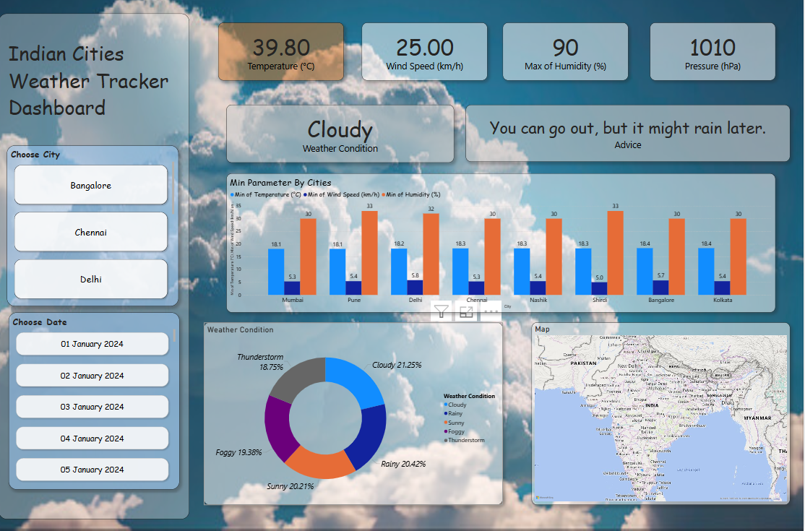

# Indian-Cities-Weather-Dashboard
An interactive Power BI dashboard that visualizes key weather metrics—temperature, humidity, wind speed, and pressure—across major Indian cities, helping users explore trends and gain actionable insights.

# 📊 Indian Cities Weather Tracking Dashboard

This is an **interactive weather dashboard** built with **Power BI**, designed to track and analyze weather data across major cities in India. Users can select cities and dates to view important parameters such as temperature, wind speed, humidity, and atmospheric pressure. The dashboard also provides suggestions based on weather conditions to help users plan their day.

---

## ✅ Key Features
- Visualize weather data for cities like **Bangalore, Chennai, Delhi, Kolkata, Mumbai**, and more.
- View max temperature, wind speed, humidity, and pressure.
- Get advice based on current weather conditions.
- Interactive city and date filters.
- Includes charts like min/max comparisons and weather condition distribution.

---

## ⚙ Tools Used
- **Power BI Desktop** – for creating interactive visuals and reports.
- **Excel** – for organizing and preprocessing data (optional, if used).

---

## 📈 What I Learned
✔ Working with real-world datasets  
✔ Designing interactive dashboards  
✔ Data visualization techniques to highlight trends  
✔ Creative problem-solving when features are restricted  
✔ Enhancing user experience with dynamic insights

---

## 📂 Explore the Project
Check it out on GitHub ➡ [https://github.com/Atharva0336/Indian-Cities-Weather-Dashboard](https://github.com/Atharva0336/Indian-Cities-Weather-Dashboard)

Feel free to explore, comment, or collaborate!
